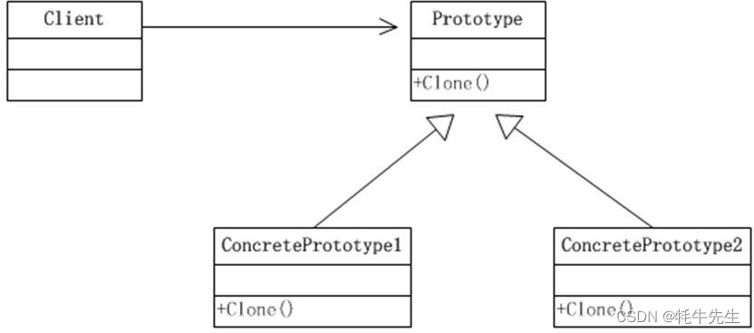

## 原型模式（Prototype Pattern） #
***
### 1.介绍
#### 1.1 定义
> 允许一个对象再创建另外一个可定制的对象，无需知道如何创建的细节。即用原型实例指定创建对象的种类，并且通过拷贝这些原型，创建新的对象。

#### 1.2 工作原理
> 将原型对象传给那个要发动创建的对象，这个要发动创建的对象通过请求原型对象拷贝它们自己来实施创建。即用基类Object的clone()方法或序列化。

#### 1.3.结构与模式
> 原型模式包含以下主要角色
>> * 抽象原型类：规定了具体原型对象必须实现的接口。
>> * 具体原型类：实现抽象原型类的 clone() 方法，它是可被复制的对象。
>> * 访问类：使用具体原型类中的 clone() 方法来复制新的对象。
>> * 抽象原型类：规定了具体原型对象必须实现的接口。

> 结构图
>> 

### 2.应用场景
> 使用原型模式创建对象比直接new一个对象在性能上要好的多，因为Object类的clone方法是一个本地方法，它直接操作内存中的二进制流，特别是复制大对象时，性能的差别非常明显。
使用原型模式的另一个好处是简化对象的创建，使得创建对象就像我们在编辑文档时的复制粘贴一样简单。

> 因为以上优点，所以在需要重复地创建相似对象时可以考虑使用原型模式。比如需要在一个循环体内创建对象，假如对象创建过程比较复杂或者循环次数很多的话，使用原型模式不但可以简化创建过程，而且可以使系统的整体性能提高很多。