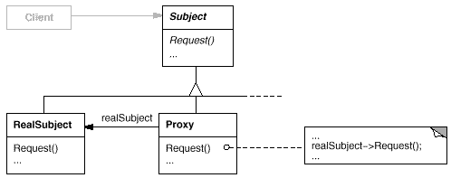

### 代理模式：为其他对象提供一种代理（中介）以控制对这个对象的访问

### 一、代理模式中的角色：

* #### 抽象主题（Subject）
> 声明了目标对象和代理对象的共同接口，这样一来在任何可以使用目标对象的地方都可以使用代理对象。

* #### 具体主题（RealSubject)
> 也称为委托角色或者被代理角色。定义了代理对象所代表的目标对象。

* #### 代理主题（Proxy)
> 也叫委托类、代理类。代理对象内部含有目标对象的引用，从而可以在任何时候操作目标对象；代理对象提供一个与目标对象相同的接口，

> 以便可以在任何时候替代目标对象。代理对象通常在客户端调用传递给目标对象之前或之后，执行某个操作，而不是单纯地将调用传递给目标对象。

> 代理模式又分为静态代理和动态代理。静态代理是由程序猿创建或特定工具自动生成源代码，再对其编译。在程序运行前，代理类的.class文件就已经存在了。
> 动态代理是在程序运行时，通过运用反射机制动态的创建而成。
### 二、动态代理
> 动态代理是指在运行时，动态生成代理类。即，代理类的字节码将在运行时生成并载入当前的ClassLoader。与静态代理类想比，动态类有诸多好处。

> 首先，不需要为真是主题写一个形式上完全一样的封装类，假如主题接口中的方法很多，为每一个接口写一个代理方法也是非常烦人的事，如果接口有变动，
> 则真实主题和代理类都要修改，不利于系统维护；

> 其次，使用一些动态代理的生成方法甚至可以在运行时指定代理类的执行逻辑，从而大大提升系统的灵活性。
动态代理也分为两类：基于接口的代理和基于继承的代理，两类实现的代表是：JDK代理 与 CGlib代理
* #### 2.1 JDK代理模式
> JDK动态代理主要涉及java.lang.reflect包下的两个类：Proxy类和InvocationHandler接口。

> JDK代理实现的三个要点：
* >① 通过Java.lang.reflect.Proxy类来动态生成代理类；
* >② 代理类要实现InvocationHandler接口；
* >③ JDK代理只能基于接口进行动态代理的；
> 我们在subject接口中新增加了一个hello()方法，然后在RealSubject中对hello()方法进行实现，但是在代理类中，
> 我们不需要再去为hello方法再去写一个代理方法，而是通过反射调用目标对象的方法，来动态的生成代理类。

#### 总结：
>因为利用JdkProxySubject生成的代理类实现了接口，所以目标类中所有的方法在代理类中都有；
生成的代理类的所有方法都拦截了目标类的所有的方法。而拦截器中invoke方法的内容正好就是代理类的各个方法的组成体；
利用JDK代理方式必须有接口的存在。
* #### 2.2 CGLib代理模式
> CGLib采用非常底层的字节码技术，可以为一个类创建子类，并在子类中采用方法去技术拦截所有的父类方法的调用，并顺势织入横切逻辑。

> CGLib和JDK的原理类似，也是通过方法去反射调用目标对象的方法。